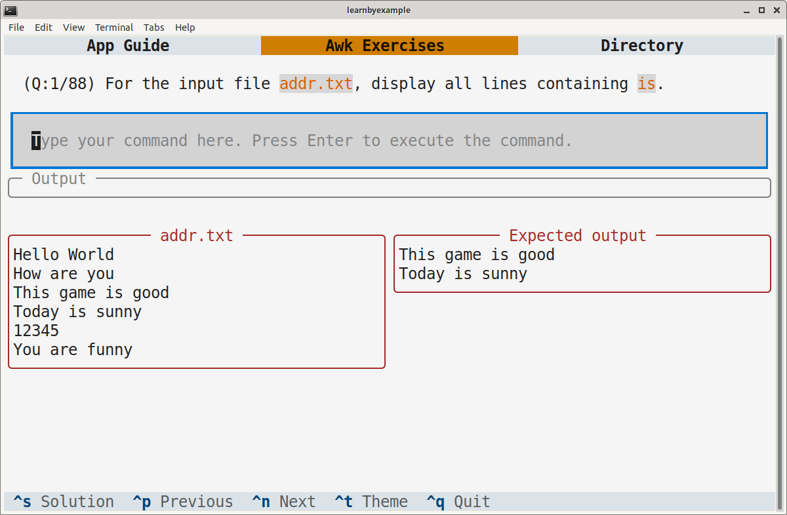

# Awk Exercises

This TUI application includes 80+ questions meant to be solved using `GNU awk`. Some exercises will require you to combine `awk` with other CLI tools such as `tac`.

> **Note**  
> This application is intended to be run in a Linux-like environment. You might still be able to solve the exercises on other platforms, but I do not know if that'll work.

# Installation

TODO: PyPI package

As an alternative, you can install `textual` (see [Textual documentation](https://textual.textualize.io/getting_started/) for more details), clone this repository and run the `awk_exercises.py` file.

Adjust the terminal dimensions for the widgets to appear properly, for example 84x25 (characters x lines). Here's a sample screenshot:

# Guide

See [app_guide.md](./app_guide.md)

# Ebook

See my [CLI text processing with GNU awk](https://github.com/learnbyexample/learn_gnuawk) ebook to learn `GNU awk` with hundreds of examples and exercises.

# License

Code snippets are licensed under [MIT LICENSE](../LICENSE)

Exercise questions and associated files (like `questions.json`) are licensed under [Creative Commons Attribution-NonCommercial-ShareAlike 4.0 International License](https://creativecommons.org/licenses/by-nc-sa/4.0/)

