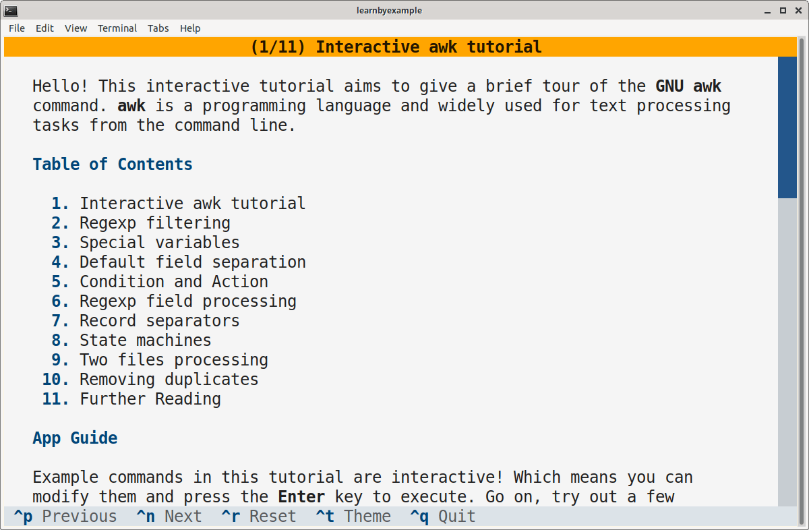

# Awk Tutorial

This interactive tutorial aims to give a brief tour of the `GNU awk` command.

# Installation

This app is available on PyPI as [awktutorial](https://pypi.org/project/awktutorial/). Example installation instructions are shown below, adjust them based on your preferences and OS.

```bash
# virtual environment
$ python3 -m venv textual_apps
$ cd textual_apps
$ source bin/activate
$ pip install awktutorial

# launch the app
$ awktutorial
```

To run the app without having to enter the virtual environment again, add this alias to `.bashrc` (or equivalent):

```bash
# you'll have to change the path
alias awktutorial='/path/to/textual_apps/bin/awktutorial'
```

As an alternative to manually managing such virtual environments, you can use [https://github.com/pypa/pipx](https://github.com/pypa/pipx) instead:

```bash
$ pipx install awktutorial
$ awktutorial
```

As yet another alternative, you can install `textual` (see [Textual documentation](https://textual.textualize.io/getting_started/) for more details), clone this repository and run the `awk_tutorial.py` file.

Adjust the terminal dimensions for the widgets to appear properly, for example 84x25 (characters x lines). Here's a sample screenshot:

<p align="center"></p>

# Ebook

See my [CLI text processing with GNU awk](https://github.com/learnbyexample/learn_gnuawk) ebook to learn `GNU awk` with hundreds of examples and exercises.

# License

Code snippets are licensed under [MIT LICENSE](../LICENSE)

Tutorial is licensed under [Creative Commons Attribution-NonCommercial-ShareAlike 4.0 International License](https://creativecommons.org/licenses/by-nc-sa/4.0/)

