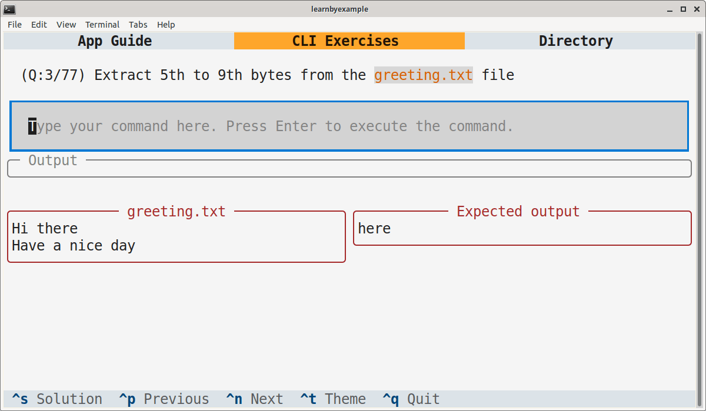

# Linux CLI Text Processing Exercises

This TUI application includes 60+ questions to test your CLI text processing skills.

> **Note**  
> This application is intended for exercises based on Linux CLI tools. You might still be able to solve the exercises on other platforms, but I'm not sure if it works.

# Installation

This app is available on PyPI as [cliexercises](https://pypi.org/project/cliexercises/). Example installation instructions are shown below, adjust them based on your preferences and OS.

```bash
# virtual environment
$ python3 -m venv textual_apps
$ cd textual_apps
$ source bin/activate
$ pip install cliexercises

# launch the app
$ cliexercises
```

To run the app without having to enter the virtual environment again, add this alias to `.bashrc` (or equivalent):

```bash
# you'll have to change the path
alias cliexercises='/path/to/textual_apps/bin/cliexercises'
```

As an alternative, you can install `textual` (see [Textual documentation](https://textual.textualize.io/getting_started/) for more details), clone this repository and run the `cli_exercises.py` file.

Adjust the terminal dimensions for the widgets to appear properly, for example 84x25 (characters x lines). Here's a sample screenshot:

<p align="center"></p>

# Guide

See [app_guide.md](./app_guide.md)

# Video demo

https://user-images.githubusercontent.com/17766317/206649676-a913ad0d-1be7-430d-8978-98517347d86b.mp4

You can also view the [demo video on youtube](https://youtu.be/0ggfQzXeYJg).

# License

Code snippets are licensed under [MIT LICENSE](../LICENSE)

Exercise questions and associated files (like `questions.json`) are licensed under [Creative Commons Attribution-NonCommercial-ShareAlike 4.0 International License](https://creativecommons.org/licenses/by-nc-sa/4.0/)

