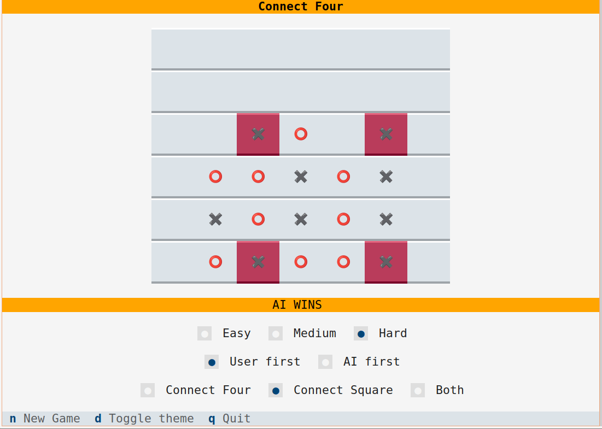

# Connect Four

From [wikipedia: Connect Four](https://en.wikipedia.org/wiki/Connect_Four):

>Connect Four is a game in which the players choose a color and then take turns dropping colored tokens into a six-row, seven-column vertically suspended grid. The pieces fall straight down, occupying the lowest available space within the column. The objective of the game is to be the first to form a horizontal, vertical, or diagonal line of four of one's own tokens.

As a twist, this TUI implementation also offers two more variations of the game:

* form a square, i.e. four cells forming 90 degree angles and equidistant from each other
* form a line or square

# Installation

TODO: publish the app on PyPI

As an alternative, you can install `textual==0.85.2` (see [Textual documentation](https://textual.textualize.io/getting_started/) for more details), clone this repository and run the `connect_four.py` file.

Terminal dimension should be at least 84x30 (characters x lines) for the game widgets to appear properly. A sample screenshot is shown below:

# Guide

* Press the **n** key to start a new game. Existing game, if any, will be abandoned
* You can choose between **Connect Four** (default), **Connect Square** and **Both** types of game
* You can choose between **Easy** (default), **Medium** and **Hard** difficulty modes:
    * In the *Easy* mode, the AI will make a random move
    * In the *Medium* mode, the AI will make a random move based on certain weight calculations
    * In the *Hard* mode, the AI will make the best move based on the weight calculations (the algorithm is based only on the current board state and thus it is not impossible for the user to win)
* The first move is based on the **User first** (default) and **AI first** choices
* Only the bottom most empty cell of each column will be considered as a valid move
* Press the **t** key to toggle between light and dark themes
* Press the **q** key to quit the app

User moves are denoted by the ⭕️ character and AI moves are denoted by the ✖️  character.

The text panel under the game board displays the current status of the game. If the game ends with one of the players forming a valid line or square, the cells forming the winning move will be highlighted.

