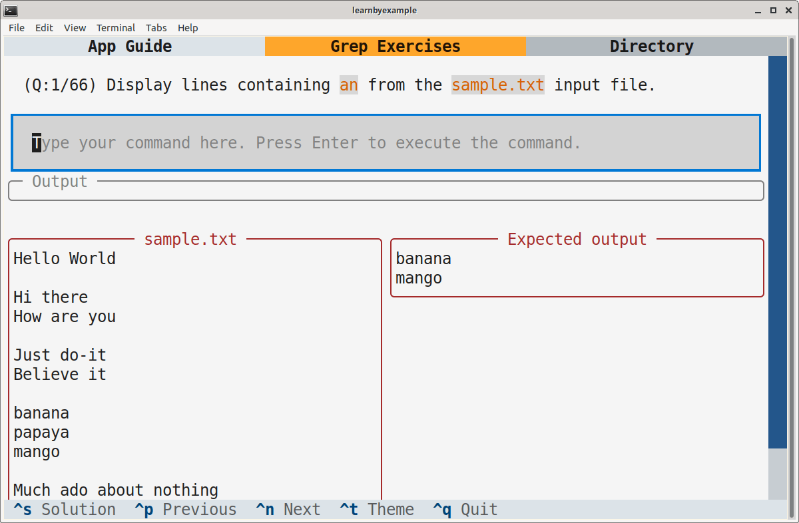

# Grep Exercises

This TUI application includes 50+ questions meant to be solved using `GNU grep` (or alternate implementations like `ripgrep`). Some exercises will require you to combine `grep` with other standard commands such as `cat`, `wc` and `find`.

> **Note**  
> This application is intended to be run in a Linux-like environment. You might still be able to solve the exercises on other platforms, but I do not know if that'll work.

# Installation

This app is available on PyPI as [grepexercises](https://pypi.org/project/grepexercises/). Example installation instructions are shown below, adjust them based on your preferences and OS.

```bash
# virtual environment
$ python3 -m venv textual_apps
$ cd textual_apps
$ source bin/activate
$ pip install grepexercises

# launch the app
$ grepexercises
```

To run the app without having to enter the virtual environment again, add this alias to `.bashrc` (or equivalent):

```bash
# you'll have to change the path
alias grepexercises='/path/to/textual_apps/bin/grepexercises'
```

As an alternative, you can install `textual` (see [Textual documentation](https://textual.textualize.io/getting_started/) for more details), clone this repository and run the `grep_exercises.py` file.

Adjust the terminal dimensions for the widgets to appear properly, for example 84x25 (characters x lines). Here's a some sample screenshot:

<p align="center"></p>

# Guide

See [app_guide.md](./app_guide.md)

# Ebook

See my [CLI text processing with GNU grep and ripgrep](https://github.com/learnbyexample/learn_gnugrep_ripgrep) ebook to learn `GNU grep` and `ripgrep` with hundreds of examples and exercises.

# License

Code snippets are licensed under [MIT LICENSE](../LICENSE)

Exercise questions and associated files (like `questions.json`) are licensed under [Creative Commons Attribution-NonCommercial-ShareAlike 4.0 International License](https://creativecommons.org/licenses/by-nc-sa/4.0/)

