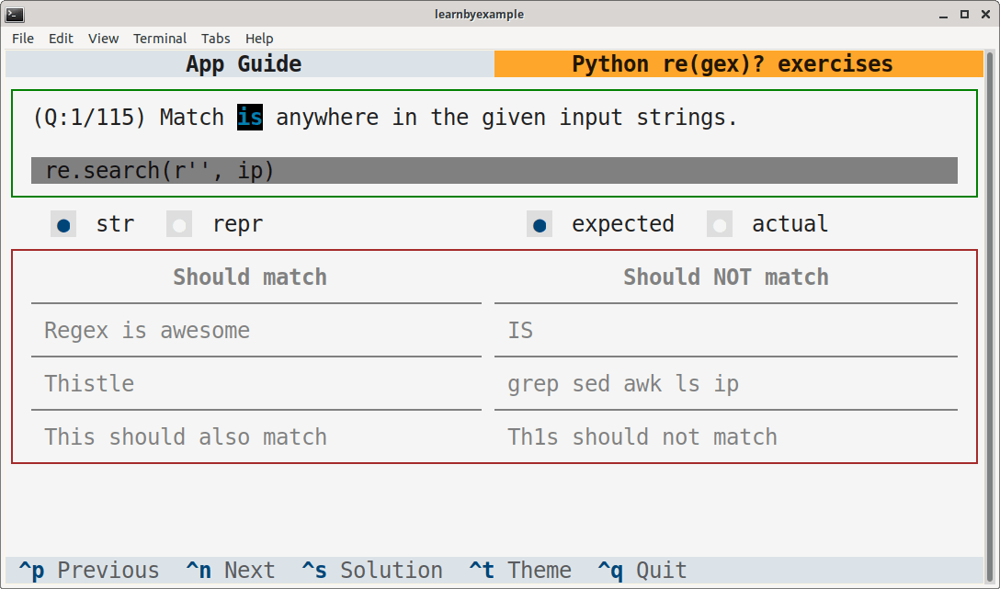

# Python re(gex)? exercises

This TUI application is intended to help you practice Python regular expressions. There are more than 100 exercises covering both the builtin `re` and third-party `regex` module.

# Installation

This app is available on PyPI as [regexexercises](https://pypi.org/project/regexexercises/). Example installation instructions are shown below, adjust them based on your preferences and OS.

```bash
# virtual environment
$ python3 -m venv textual_apps
$ cd textual_apps
$ source bin/activate
$ pip install regexexercises

# launch the app
$ regexexercises
```

> **Note**  
> If you are on Windows, using the [Windows Terminal](https://en.wikipedia.org/wiki/Windows_Terminal) is recommended. See [this issue](https://github.com/learnbyexample/TUI-apps/issues/3#issuecomment-1481488042) for Virtual Environment commands and other details.

To run the app without having to enter the virtual environment again, add this alias to `.bashrc` (or equivalent):

```bash
# you'll have to change the path
alias regexexercises='/path/to/textual_apps/bin/regexexercises'
```

As an alternative, you can install `textual` (see [Textual documentation](https://textual.textualize.io/getting_started/) for more details), clone this repository and run the `pyregex_exercises.py` file.

Adjust the terminal dimensions for the widgets to appear properly, for example 84x25 (characters x lines). Here's a sample screenshot:

<p align="center"></p>

# Guide

See [app_guide.md](./app_guide.md)

# Video demo

You can view a demo video about this app on Youtube: [https://youtu.be/0oXPeF8HutQ](https://youtu.be/0oXPeF8HutQ)

# Ebook

See my [Understanding Python re(gex)?](https://github.com/learnbyexample/py_regular_expressions) ebook to learn regular expressions with hundreds of examples and exercises.

# License

Code snippets are licensed under [MIT LICENSE](../LICENSE)

Exercise questions and associated files (like `questions.json`) are licensed under [Creative Commons Attribution-NonCommercial-ShareAlike 4.0 International License](https://creativecommons.org/licenses/by-nc-sa/4.0/)

