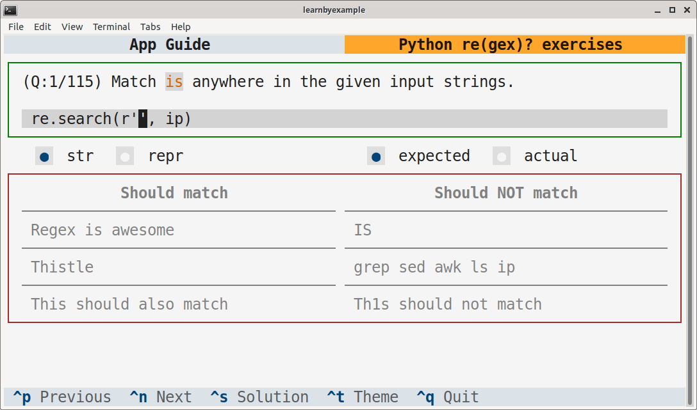

# Python re(gex)? exercises

This TUI application is intended to help you practice Python regular expressions. There are more than 100 exercises covering both the builtin `re` and third-party `regex` module.

# Installation

To be added after releasing a package.

Here's a sample screenshot:

# Guide

See [app_guide.md](./app_guide.md)

# Ebook

See my [Understanding Python re(gex)?](https://github.com/learnbyexample/py_regular_expressions) ebook to learn regular expressions with hundreds of examples and exercises.

# License

Code snippets are licensed under [MIT LICENSE](../LICENSE)

Exercise questions and associated files (like `questions.json`) are licensed under [Creative Commons Attribution-NonCommercial-ShareAlike 4.0 International License](https://creativecommons.org/licenses/by-nc-sa/4.0/)

