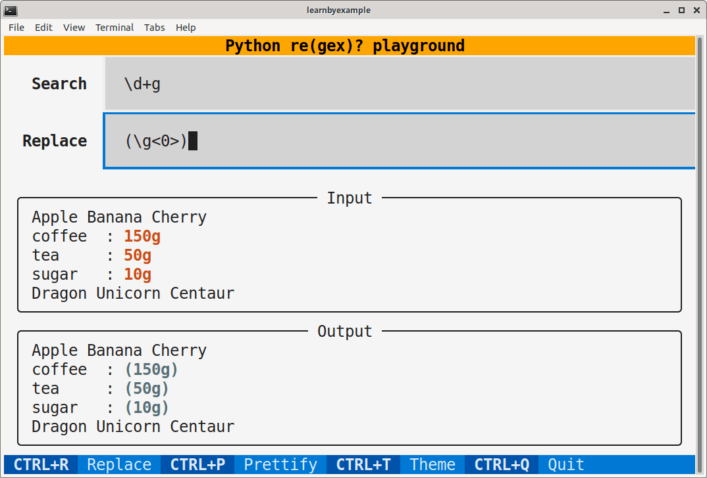

# Python re(gex)? playground

This TUI application is intended as an interactive playground for Python Regular Expressions.

> **Warning**  
> Work in progress.

# Installation

You'll need to install `textual` first. See [Textual documentation](https://textual.textualize.io/getting_started/) for more details about installation. After that, you can clone this repository and run the `pyregex_playground.py` script. Adjust terminal dimensions as needed. Example instructions shown below, adjust them based on your preferences and OS.

```bash
$ python3 -m venv textual_apps
$ cd textual_apps
$ source bin/activate
$ pip install textual==0.10.0

$ git clone --depth 1 https://github.com/learnbyexample/TUI-apps.git
$ cd TUI-apps/PyRegexPlayground
$ python pyregex_playground.py
```

Here's a sample screenshot:

<p align="center"></p>

# Guide

You can type the search and replacement patterns in the input text boxes at the top of the application. Press **Enter** key to view the results. See Footer for customization options.

# Ebook

See my [Understanding Python re(gex)?](https://github.com/learnbyexample/py_regular_expressions) ebook to learn regular expressions with hundreds of examples and exercises.

# License

Code is licensed under [MIT LICENSE](../LICENSE)

