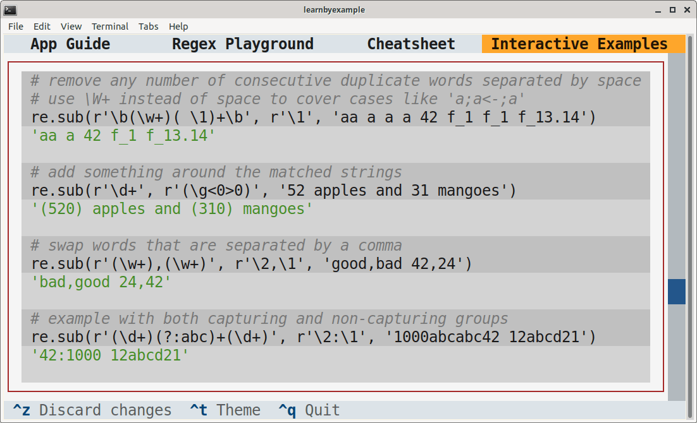

# Python re(gex)? playground

This TUI application is intended as an interactive playground for Python Regular Expressions. The app also includes a comprehensive cheatsheet and several interactive examples.

> **Warning**  
> Work in progress.

# Installation

You'll need to install `textual` first. See [Textual documentation](https://textual.textualize.io/getting_started/) for more details about installation. After that, you can clone this repository and run the `pyregex_playground.py` script. Adjust terminal dimensions as needed. Example instructions are shown below, adjust them based on your preferences and OS.

```bash
$ python3 -m venv textual_apps
$ cd textual_apps
$ source bin/activate
$ pip install textual==0.12.1

$ git clone --depth 1 https://github.com/learnbyexample/TUI-apps.git
$ cd TUI-apps/PyRegexPlayground
$ python pyregex_playground.py
```

Here are some sample screenshots:

<p align="center"></p>

<p align="center"></p><br>

# Guide

See [app_guide.md](./app_guide.md)

# Ebook

See my [Understanding Python re(gex)?](https://github.com/learnbyexample/py_regular_expressions) ebook to learn regular expressions with hundreds of examples and exercises.

# License

Code snippets are licensed under [MIT LICENSE](../LICENSE)

Explanations and associated files (like `cheatsheet.md`) are licensed under [Creative Commons Attribution-NonCommercial-ShareAlike 4.0 International License](https://creativecommons.org/licenses/by-nc-sa/4.0/)

