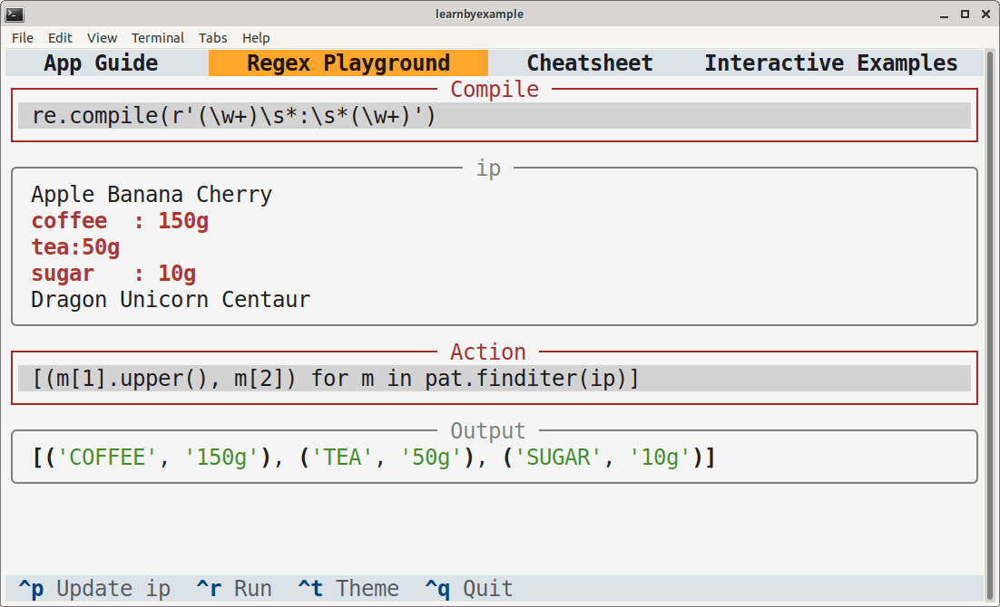

# Python re(gex)? playground

This TUI application is intended as an interactive playground for Python Regular Expressions.

> **Warning**  
> Work in progress.

# Installation

You'll need to install `textual` first. See [Textual documentation](https://textual.textualize.io/getting_started/) for more details about installation. After that, you can clone this repository and run the `pyregex_playground.py` script. Adjust terminal dimensions as needed. Example instructions are shown below, adjust them based on your preferences and OS.

```bash
$ python3 -m venv textual_apps
$ cd textual_apps
$ source bin/activate
$ pip install textual==0.10.0

$ git clone --depth 1 https://github.com/learnbyexample/TUI-apps.git
$ cd TUI-apps/PyRegexPlayground
$ python pyregex_playground.py
```

Here are some sample screenshots:

<p align="center"></p><br>

<p align="center"></p>

# Guide

You can type the search pattern in the **Compile** input box and press the **Enter** key to execute. For example, `re.compile(r'\d')` to match digit characters. Matching portions will be highlighted in red.

The compiled pattern is available via the `pat` variable and you can use `ip` to refer to the input string. You can transform or extract data by typing appropriate methods in the **Action** box. For example, `pat.sub(r'(\g<0>)', ip)` will add parenthesis around the matching portions.

The input string is obtained from the `ip.txt` file. You can change contents of this file and press **Ctrl+u** to update the `ip` variable. You'll have to press **Enter** again to update the results for the changed data.

Some of the error types are caught. In such cases, the background color of the input boxes will change to red and the error message will be displayed below the corresponding box. Other errors might result in the app crashing.

Press **Ctrl+t** to toggle the theme between light and dark modes.

Press **Ctrl+g** or **F1** to display this guide from within the app. Press **Esc** to go back.

> **Warning**  
> There is no safeguard against the commands you have typed. They are treated as if you executed them from a Python program.

# Ebook

See my [Understanding Python re(gex)?](https://github.com/learnbyexample/py_regular_expressions) ebook to learn regular expressions with hundreds of examples and exercises.

# License

Code is licensed under [MIT LICENSE](../LICENSE)

