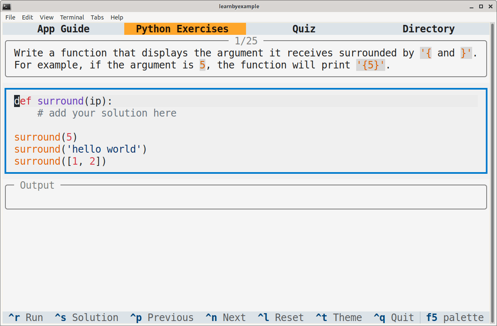
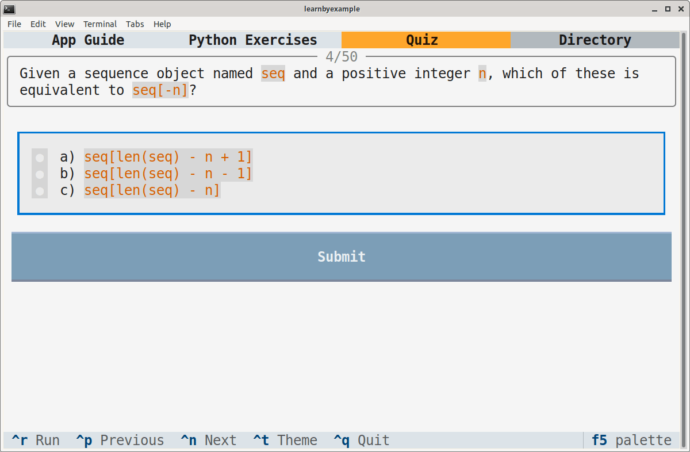

# Python Exercises

This interactive TUI app includes exercises and multiple-choice questions intended to test the understanding of beginner to intermediate level Python learners.

# Installation

This app is available on PyPI as [pythonexercises](https://pypi.org/project/pythonexercises/). Example installation instructions are shown below, adjust them based on your preferences and OS.

```bash
# virtual environment
$ python3 -m venv textual_apps
$ cd textual_apps
$ source bin/activate
$ pip install pythonexercises

# launch the app
$ pythonexercises
```

> **Note**  
> If you are on Windows, using the [Windows Terminal](https://en.wikipedia.org/wiki/Windows_Terminal) is recommended. See [this issue](https://github.com/learnbyexample/TUI-apps/issues/3#issuecomment-1481488042) for Virtual Environment commands and other details.

To run the app without having to enter the virtual environment again, add this alias to `.bashrc` (or equivalent):

```bash
# you'll have to change the path
alias pythonexercises='/path/to/textual_apps/bin/pythonexercises'
```

As an alternative to manually managing such virtual environments, you can use [https://github.com/pypa/pipx](https://github.com/pypa/pipx) instead:

```bash
$ pipx install pythonexercises
$ pythonexercises
```

As yet another alternative, you can install `textual` (see [Textual documentation](https://textual.textualize.io/getting_started/) for more details), clone this repository and run the `python_exercises.py` file. You'll need to install `textual[syntax]` to enable syntax highlighting (see [documentation](https://textual.textualize.io/widgets/text_area/#syntax-highlighting-dependencies) for more details).

Adjust the terminal dimensions for the widgets to appear properly, for example 84x25 (characters x lines). Here are sample screenshots:

<p align="center"></p>

<p align="center"></p>

# Guide

See [app_guide.md](./app_guide.md)

# Ebook

The exercise and quiz questions in this app have been adapted from my [100 Page Python Intro](https://github.com/learnbyexample/100_page_python_intro) ebook.

# License

Code snippets are licensed under [MIT LICENSE](../LICENSE).

Exercise questions and associated files (like `exercises.json` and `quiz.txt`) are licensed under [Creative Commons Attribution-NonCommercial-ShareAlike 4.0 International License](https://creativecommons.org/licenses/by-nc-sa/4.0/).

