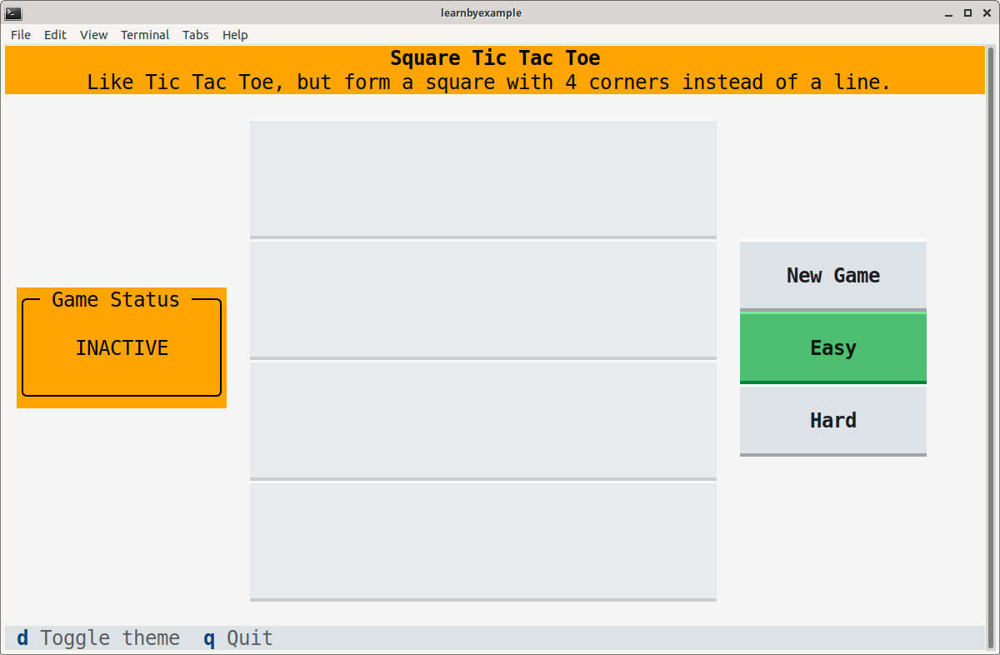

# Square Tic Tac Toe

In Tic Tac Toe, a player wins by forming a line with three consecutive cells in any direction — horizontal, vertical or diagonal. In this modified version, a player has to form a square, i.e. four cells forming 90 degree angles and equidistant from each other.

A 3x3 grid would be too small a playing area, so 4x4 grid is used instead. Compared to 8 possible lines in Tic Tac Toe, this game has 20 possible squares. Can you spot all of them? Here's an illustration to help you:

<p align="center"></p>

# Installation

You'll need to install `textual` first. See [Textual documentation](https://textual.textualize.io/getting_started/) for details. After that, you can clone this repository and run the `square_tictactoe.py` script. Terminal dimension should be at least 84x25 for the game widgets to appear properly. Example instructions shown below, adjust them based on your preferences and OS.

```bash
$ python3 -m venv textual_apps
$ cd textual_apps
$ source bin/activate
$ pip install textual

$ git clone --depth 1 https://github.com/learnbyexample/TUI-apps.git
$ cd TUI-apps/SquareTicTacToe
$ python3 square_tictactoe.py
```

You should get a screen similar to the one shown below:

<p align="center"></p>

# Game controls

* Click the **New Game** button to start a new game. Existing game, if any, will be abandoned.
* You can choose between **Easy** (default) and **Hard** modes by clicking those buttons.
    * In *Easy* mode, the AI will make the first move with a 50% chance and afterwards it will make a move randomly in response to user moves.
    * In *Hard* mode, the AI will always make the first move and at best you'll be able to TIE the game ;)
    * These choices will come into effect only after a new game is started.
* Press **d** key to switch between light and dark themes.
* Press **q** key or **Ctrl+c** to quit the app.

User moves are denoted by the ⭕️ character and AI moves are denoted by the ✖️  character.

The text area to the left of the game board displays the current status of the game. If the game ends with one of the players forming a valid square, the winning square will be highlighted.

# Blog post

Check out my blog post [Building TUIs with textual: first impressions](https://learnbyexample.github.io/textual-first-impressions/) for motivations behind this project, what I liked about the framework, etc.

# Tkinter version and AI algorithm

**Square Tic Tac Toe** was one of the projects in my [Practice Python Projects](https://github.com/learnbyexample/practice_python_projects) ebook. I had used the `tkinter` module for that version.

Visit [this link](https://learnbyexample.github.io/practice_python_projects/square_tic_tac_toe/square_tic_tac_toe_ai.html#weight-based-algorithm) for an explantion of the weight based AI used in this game.

# Type hints

I didn't have experience with type hinting before. Tried to make it work and then gave up when it came to `dict`. On the positive side, it caught an issue when I wrongly used `disabled` as a `Button` variant.

